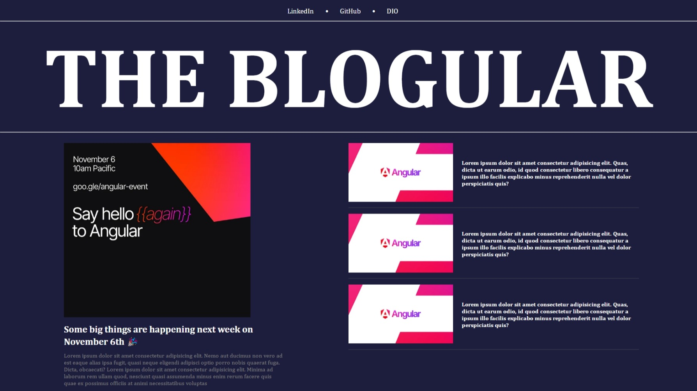

### ⚠️ EM DESENVOLVIMENTO

# The Blogular

Um projeto DIO para o Bootcamp de Desenvolvimento Frontend com Angular.

## Inspiração

Apesar de consolidar uma base sólida durante o bootcamp, busco expandir meu conhecimento e buscar inspirações adicionais para elevar a qualidade deste blog. Recentemente, encontrei no [Dribbble](https://dribbble.com/) um design fascinante criado por [Kazuya Horikirikawa](https://dribbble.com/kz18), que servirá como uma valiosa fonte de inspiração para aprimorar o visual e a experiência do usuário.

## Objetivo

Criação de um blog utilizando Angular para o desenvolvimento pessoal, como parte do desafio proposto pela DIO. O projeto busca explorar as capacidades do Angular na construção de uma plataforma interativa e responsiva. O blog finalizado será submetido como parte do desafio, contribuindo para o aprimoramento de habilidades e cumprimento dos objetivos do programa.

## Para rodar o projeto

- Garanta que você tenha o `node` e o `git` instalados em sua máquina;
- Faça o clone do projeto com `git clone https://github.com/aliciamendes/angular-blog`;
- Entre na pasta DIO_Angular_Blog com `cd angular-blog-DIO` e instale as dependências com `npm install`;
- Se não tiver o Angular CLI instalado na sua máquina, instale-o globalmente com o código `npm install -g @angular/cli`
- Rode a aplicação com `npm start`. O app será executado na porta `4200` e irá abrir automaticamente no navegador.

## Links Úteis

- [Dribbble - Kazuya Horikirikawa ](https://dribbble.com/shots/4055335-Blog-Site)
- [DIO - Digital Innovation One](https://www.dio.me/)
- [Angular Docs](https://angular.io/docs)
